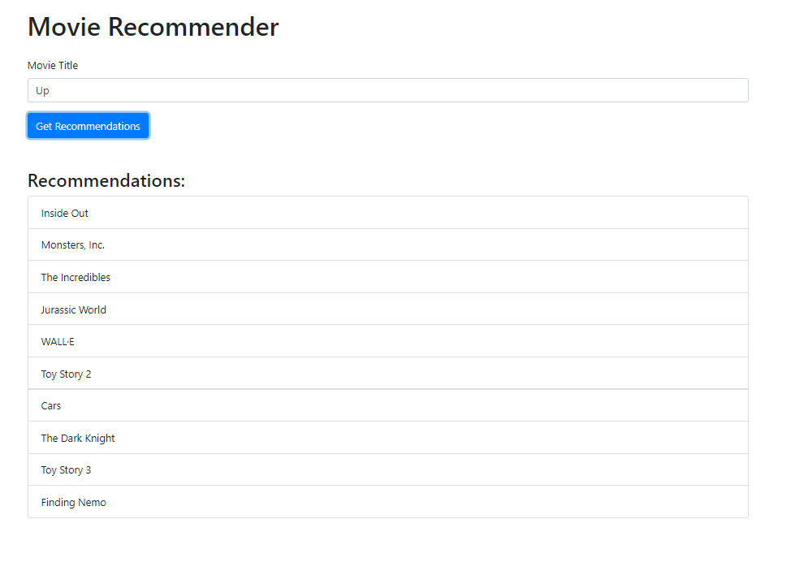

# film_suggestions

## Description

This is a simple web application that allows users to search for movies and get suggestions based on their search.

## Technologies

- Flask
- HTML
- CSS
- JavaScript

## Requirements

python >= 3.9

To run the project, you need to have Python installed on your machine. You can download Python from the [official website](https://www.python.org/downloads/)

**Setting Up the Environment**

* Windows: `./setup_Windows.bat`
* Linux/macOS: `./setup_Linux.sh`

These scripts will install required dependencies, and build a virtual environment for you if you don't have one.

## Usage

To run the project, execute the following commands:

```bash
cd bin
python ./app.py
```

The application will be running on `http://127.0.0.1:5000/`, it will open automatically in your default browser.



## License

This project is licensed under the MIT License - see the [LICENSE](LICENSE) file for details.

## Author

[Neetre](https://github.com/Neetre)
